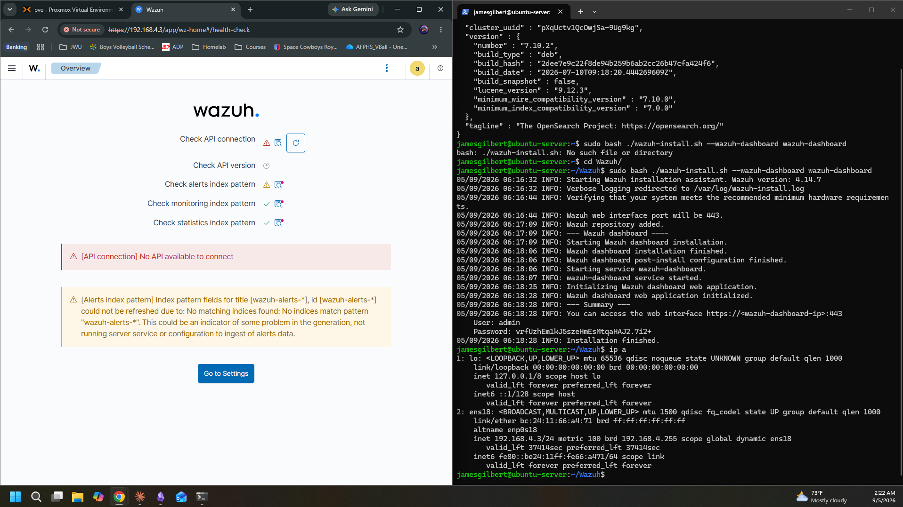
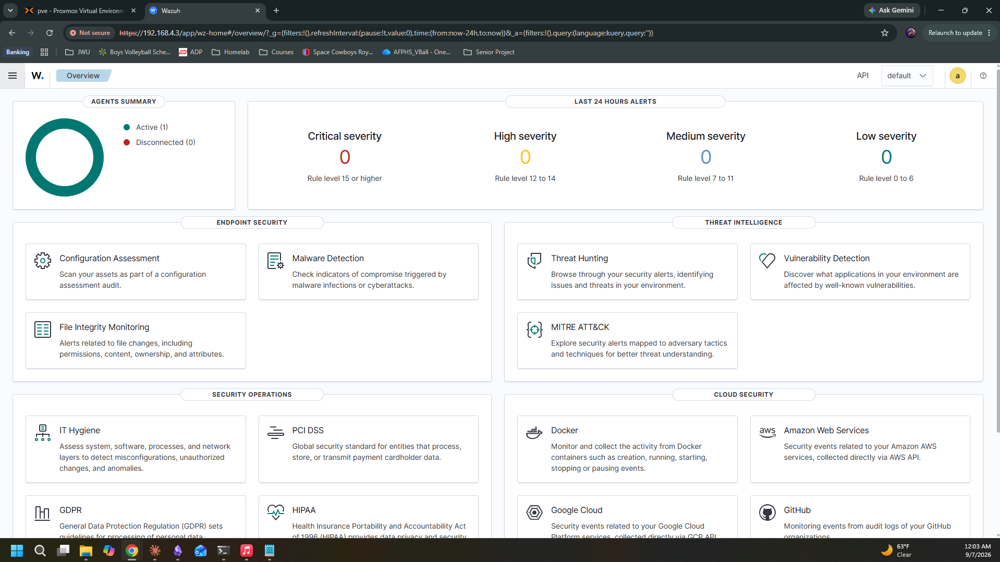
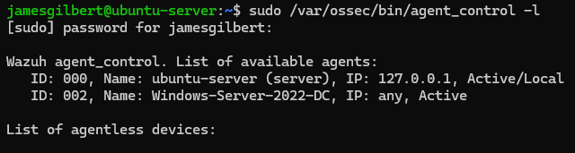

# Wazuh SIEM Deployment: Manager, Indexer, and Dashboard on Proxmox

## Executive Objective

The goal of this lab was to deploy a functional Wazuh SIEM stack (manager, indexer, dashboard) on a dedicated Ubuntu Server VM within my Proxmox homelab, then enroll my Windows Server 2022 domain controller as a monitored agent. This lays the groundwork for future log analysis, security configuration assessment, and simulated attack detection (Atomic Red Team, password spraying) as part of my SOC/IAM skill-building track.

## Architecture Topology

- **Hypervisor:** Proxmox VE 9.2.2, running on a Dell Optiplex 3060 (8GB RAM total, 6 CPU threads)
- **Wazuh VM:** Ubuntu Server, 4GB RAM / 2 vCPU, hosting the Wazuh manager, indexer, and dashboard together (single-node deployment)
- **Monitored endpoint:** Windows Server 2022 domain controller (khoo.local), 3GB RAM / 2 vCPU, running the Wazuh agent
- **Network:** Both VMs on a flat 192.168.4.x subnet behind a GL.iNet Mango travel router in repeater mode
- **Key ports:** 55000 (Wazuh API), 1515 (agent enrollment/authd), 1514 (agent data), 443 (dashboard), 9200 (indexer)

## Operational Execution

1. Installed the Wazuh manager, indexer, and dashboard using the official `wazuh-install.sh -a` assistant script rather than piecing together individual `.deb` packages, after early attempts to manually chain installs led to package conflicts.
2. Installed the Wazuh agent on the DC via `msiexec`, passing `WAZUH_MANAGER` and `WAZUH_REGISTRATION_SERVER` parameters to auto-enroll without touching the GUI config screen.
3. Verified agent enrollment from the manager side using `agent_control -l`, confirming Active status.
4. Right-sized VM resource allocation after discovering the host's 8GB RAM ceiling didn't support running both VMs at full default allocation simultaneously. Settled on 4GB/2 vCPU for the Wazuh VM and 3GB/2 vCPU for the DC.
5. Renamed the agent post-enrollment by removing it via `manage_agents` and reinstalling with a new `WAZUH_AGENT_NAME`, since Wazuh does not support in-place agent renaming.

## Log Analysis

With the agent active, the Wazuh agent's built-in modules began working immediately on the DC:
- **Security Configuration Assessment (SCA):** ran a CIS Windows Server 2022 benchmark scan out of the box, no extra config needed
- **File Integrity Monitoring (FIM):** started a baseline scan on a 43200-second interval
- **Log collection:** actively ingesting Application, Security, and System Windows Event Logs

Next step is deliberately generating Security log events (failed logons, account lockouts) to confirm they surface correctly in the dashboard's alert view before moving into simulated attack scenarios.

## Hardening / Remediation

- Confirmed all three core services (`wazuh-manager`, `wazuh-indexer`, `wazuh-dashboard`) are set to `enabled` so they survive a host reboot, rather than relying on manual starts.
- Identified that resource contention (not a config bug) caused the Wazuh API to intermittently time out when both the DC and full Wazuh stack ran simultaneously on a RAM-constrained host. Adopted a "DC on to generate activity, DC off to review the dashboard" workflow rather than trying to run everything concurrently on hardware that can't support it.
- Flagged a longer-term option (adding physical RAM to the host) as the real fix if I want to run the full stack plus multiple endpoints concurrently down the line.

## Troubleshooting Log (Lessons Learned)

This deployment did not go cleanly, and the failures were arguably more instructive than a smooth install would have been:

| Issue | Root Cause | Fix |
|---|---|---|
| `403 Forbidden` on direct `.deb` download | Known intermittent issue with Wazuh's package CDN | Used the install assistant script instead of direct `wget` |
| `wazuh-install.sh` returned XML `AccessDenied` | Used the `4.x` branch path instead of the versioned `4.14` path for the script specifically | Corrected URL to `packages.wazuh.com/4.14/wazuh-install.sh` |
| Dashboard install failed: "no certificate for node dashboard" | Used an arbitrary node name (`dashboard`) that didn't match the name baked into the generated cert bundle | Inspected `wazuh-install-files.tar` contents to find the actual expected node name (`wazuh-dashboard`) |
| Dashboard failed with "indexer security settings not initialized" | Installed indexer and dashboard as separate targeted steps, skipping the `--start-cluster` step that normally runs as part of a full `-a` install | Ran `wazuh-install.sh --start-cluster` manually |
| Agent stuck in enrollment loop (`Unable to connect to enrollment service`) | `wazuh-manager` service was not actually running (`inactive (dead)`) despite being marked `enabled` | Manually started the service; confirmed port 1515 came alive |
| Manager didn't auto-start after a clean reboot despite `enabled` status | Likely a leftover instability from repeated install/purge cycles earlier in the session, not a genuine systemd dependency race (confirmed via a second clean reboot test) | Manually started once; second reboot test came up clean on its own |
| Wazuh API returned `Timeout executing API request` | Host-level RAM exhaustion: 8GB host running a 4GB Wazuh VM and 3GB DC VM simultaneously left no headroom, driving CPU load average to 3.37 on a 2-core VM | Adopted a sequential workflow (DC on for activity generation, DC off for dashboard review) instead of running both concurrently |
| Dashboard stuck returning `503 Service Unavailable` / "not ready yet" | Wazuh indexer had crashed: its JVM couldn't start because `/var/log/wazuh-indexer/` had been deleted or never recreated during an earlier reinstall cycle | Recreated the directory with correct `wazuh-indexer:wazuh-indexer` ownership and permissions, then restarted the service |

**Biggest takeaway:** most of these failures compounded from an initial round of manual, piecemeal component installs before switching to the official install script. Once things were reset to a clean baseline, remaining issues were resource constraints and one file-permissions gap, not architectural problems. For future multi-service deployments, doing the full automated install first and only breaking out individual components when there's a specific reason to is the more reliable path.

## Next Steps

- Deploy Wazuh agents on remaining homelab endpoints (Windows 11 clients)
- Simulate authentication attacks (password spraying) against the DC and confirm Wazuh surfaces the relevant Windows Security event IDs (4625, 4740)
- Run Atomic Red Team techniques against the DC and validate detection coverage
- Evaluate whether physical RAM expansion on the Optiplex 3060 is worth the investment to support concurrent multi-VM operation